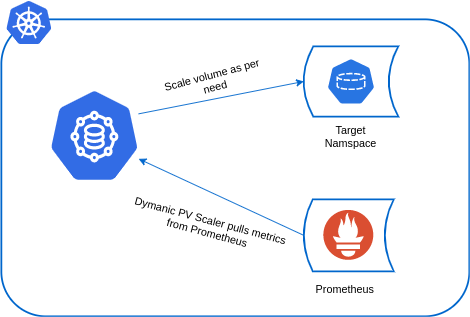
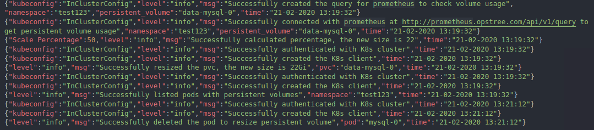

## Opstree PV(Persistent Volume) Scaler


A golang based Kubernetes application which has been created to overcome the scaling issue of Persistent Volume in Kubernetes. This can scale the Persistent Volume on the basis of threshold which you have set.

## Getting Started

### Architecture



### Pre-requisites

Sorry none of these pre-requisites can be compromised. So you guys have to meet these requirements :slightly_smiling_face:

- Kubernetes cluster version should be greater than 1.11+
- Prometheus should be have the information of Persistent Volume
- In storageclass, *allowVolumeExpansion* flag should be `true`

Example:-

```yaml
---
apiVersion: storage.k8s.io/v1
kind: StorageClass
metadata:
  name: standard
provisioner: kubernetes.io/aws-ebs
parameters:
  type: gp2
reclaimPolicy: Retain
allowVolumeExpansion: true # This should be true for every storage class
mountOptions:
  - debug
volumeBindingMode: Immediate
```

That's it

### Configuration

We are using helm to maintain the deployment and release in Kubernetes cluster. [Hit Me](./deploy/helm). But for configuration part this application accepts a yaml file `.config.yaml`:

```yaml
---
- namespace: database
  scale_percentage: 50
  threshold_percentage: 80
  pvc_name: data-mysql-0
```

Configuration file overview:-

| **Field** | **Default Value** | **Possible Values** | **Description** |
|-----------|-------------------|---------------------|-----------------|
| namespace | - | *Any valid k8s namespace* | Persistent Volume's namespace which needs to be watched |
| scale_percentage | - | *Any integer* | How much percent you want to scale your pv |
| threshold_percentage | - | *Any integer* | The target percentage after which you want to scale the pv |
| pvc_name | - | *Any valid k8s pvc name* | Name of the pvc which you want to scale |

Make sure you have updated the configuration in [values.yaml](./deploy/helm/values.yaml).

### Installation

Simply use the helm chart to install it on your flavor of Kubernetes.

```shell
# Deploy the PV Scaler
helm upgrade dynamic-pv-scaler ./deploy/helm --install --namespace dynamic-pv-scaler
```

Verify the installation

```shell
helm test dynamic-pv-scaler --namespace dynamic-pv-scaler
kubectl get pods -n dynamic-pv-scaler
```

### Logging

The application's logging interface is designed to print logs in JSON stdout. Example logs:-



## Development

Please see our [development documentation](./DEVELOPMENT.md) for details.

## Release

Please see our [release documentation](./CHANGELOG.md) for details.

## Contact

If you have any suggestion or query. Contact us at

opensource@opstree.com
